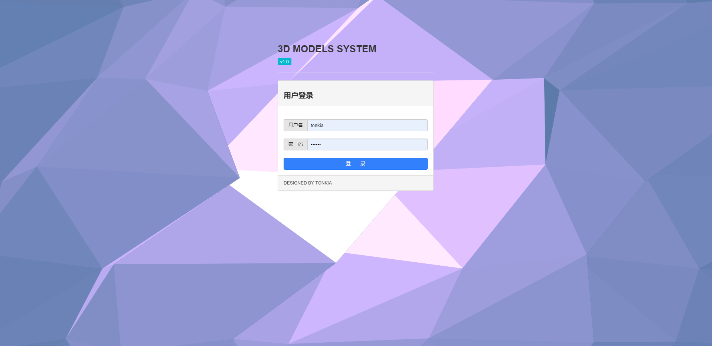
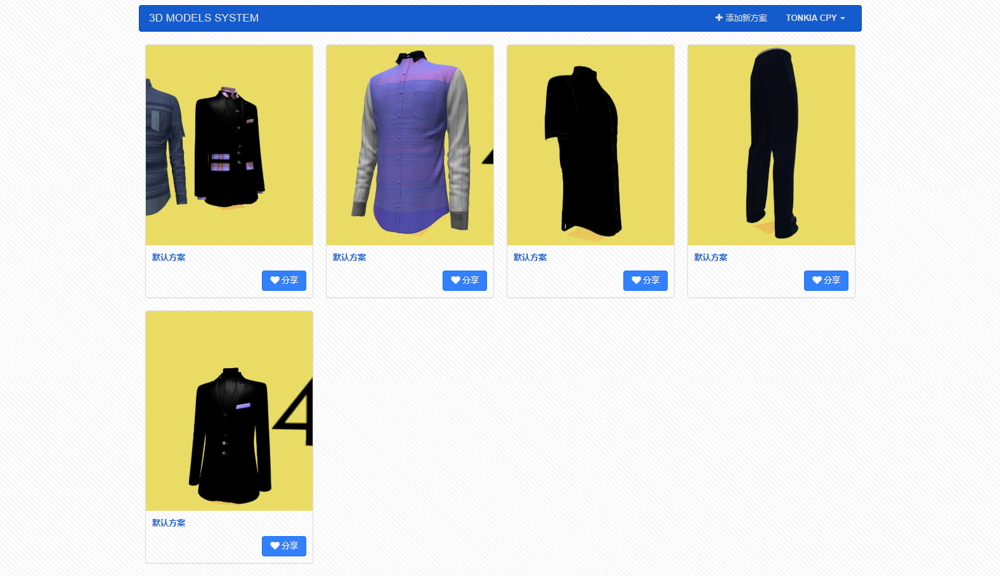
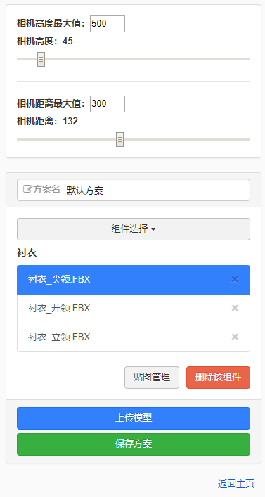
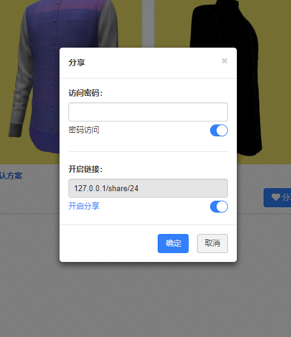

# 3dPlatform

使用Threejs开源框架，实现WEB端三维模型的定制化展示

项目源码地址：[https://github.com/TONKIA/3dPlatform](https://github.com/TONKIA/3dPlatform)

# 项目运行

```bash
cnpm install
nodemon app
```

# 效果图

#### 登录页面



#### 用户主页



#### 创建方案




#### 方案分享



#### 分享页面


# 第三方开源

- Three.js [https://github.com/mrdoob/three.js](https://github.com/mrdoob/three.js)
- ZUI [https://github.com/easysoft/zui](https://github.com/easysoft/zui)

